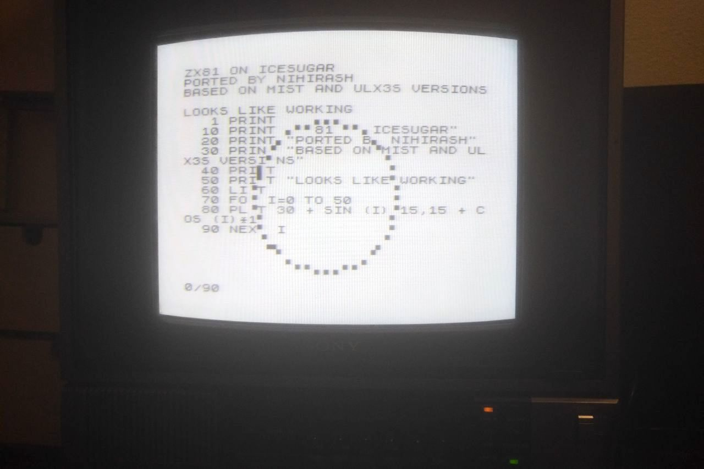
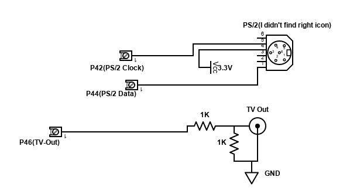
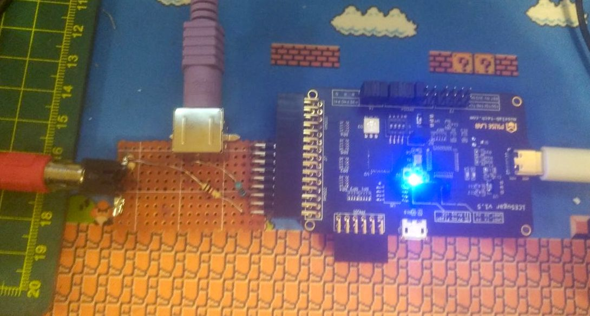

# ZX-81 implementation on iCE40 FPGA(iCESugar board)

Simple and currently incomplete(absent tape in/out) implementation of ZX81 computer with RAM Pack.

It based on [ULX3S implementation](https://github.com/lawrie/ulx3s_zx81) which based on MiST's implementation.

It easily builds with [APIO](https://github.com/fpgawars/apio) toolchain. 

I'm using only composite output but VGA with scandoubler can be easily copied from ULX3S implementation.

Warning! I did it only for educational purposes. I'm software engineer that got interested with HDL(I've just started with HDL - any dumb things are possible).

## Connection diagram

Many PS/2 keyboards works fine with 3.3V power. 

If your keyboard doesn't want work from 3.3V - please add 330-470R resistors in series with signal lines.

## Issues

Currently, not implemented:

 * Loading and saving

 * Firing reset from keyboard or button on IOs(but there is reset button on FPGA board)

